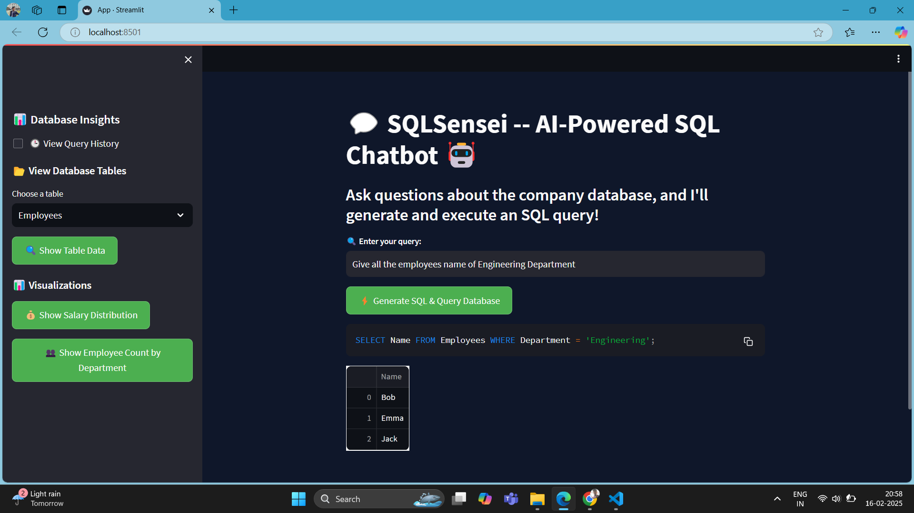

# SQLGPT----AI-powered-SQL-Chatbot

💻Problem Statement:
Managing and analyzing massive datasets manually is a daunting task, especially when the database is dynamic, constantly updated by users. With a database containing over 1,000,000 records, manually searching, filtering, and analyzing data becomes inefficient and error-prone. This challenge demands an intelligent solution that can not only provide accurate answers but also generate the corresponding SQL queries.

Solution Overview:
SQL-GPT leverages Google Gemini to create an intelligent chatbot capable of understanding complex user queries and providing precise answers with an accuracy of up to 90%. Additionally, it generates the corresponding SQL queries, enabling users to validate the results or further analyze the data.

Frontend Overview:
The frontend of SQL-GPT is built using Streamlit, a powerful Python framework designed for creating interactive and user-friendly web applications. It provides a clean and intuitive interface that enhances the user experience, making it easy for both technical and non-technical users to interact with the company database using natural language queries.

##Frontend

Key Features:
Natural Language Querying: Users can ask questions in plain English, and the chatbot translates them into accurate SQL queries.
Dynamic Data Handling: The chatbot works seamlessly with a constantly updating database, ensuring real-time insights.
High Accuracy: Delivers precise answers with up to 90% accuracy.
SQL Query Generation: Along with answers, it generates SQL queries for advanced users to verify or modify as needed.

Technology Stack:
Frontend: Streamlit (for an interactive and user-friendly interface)
Backend: Google Gemini model for natural language processing and query generation
Database: SQLite (as a company database that gets dynamically updated)

User Flow:
Ask Questions: Users ask questions in natural language about the company database.
AI Processing: Google Gemini processes the question and generates an accurate response.
SQL Query Generation: Along with the answer, the chatbot displays the corresponding SQL query.
Result Display: The results are displayed in a structured format for better analysis.

🧑‍💻Why This Solution?
This project bridges the gap between non-technical users and complex database systems. It empowers users to retrieve insights from a massive and dynamically updating database effortlessly, enhancing productivity and decision-making.

Future Enhancements:
Multi-Language Support: Expanding the chatbot's capability to understand and respond in multiple languages.
Integration with Other Databases: Adding support for MySQL, PostgreSQL, and other popular database systems.
Advanced Data Analytics: Incorporating advanced analytics features such as trend analysis and data visualization.
